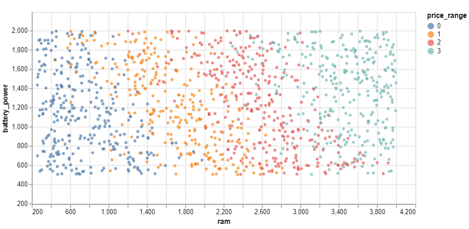
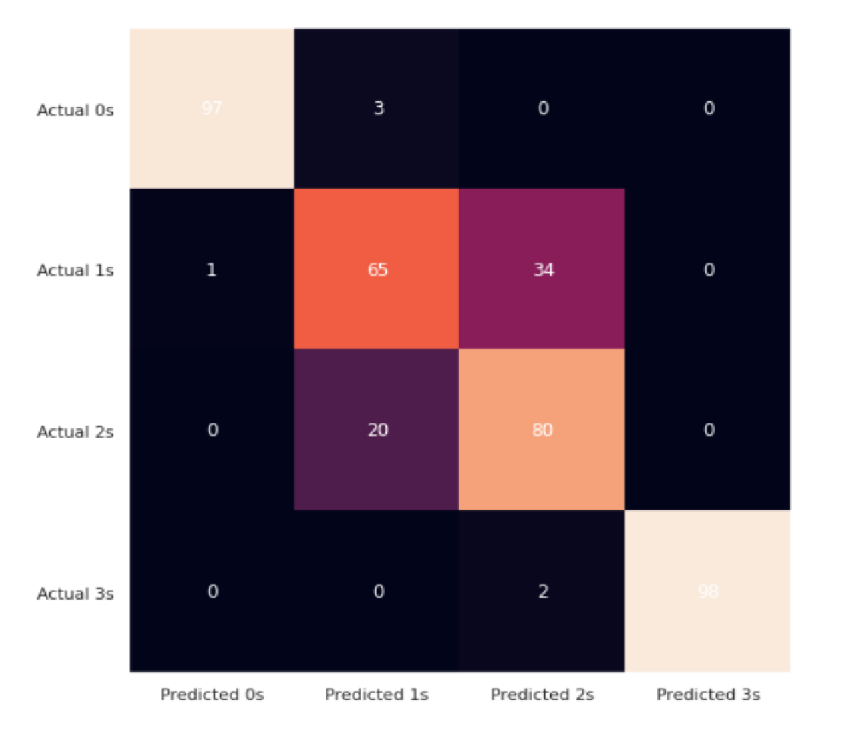

# Mobile Price Classification
Dataset: https://www.kaggle.com/datasets/iabhishekofficial/mobile-price-classification  
In this project, I performed statistical analysis and visualization on the given data using Scipy, Sklearn, Matplotlib, Seaborn, and Altair libraries.  
Plots are powerful tools for discovering relations and analyzing. From the plot below, the direct relation between ram and price_range can be resulted. 

  

 

In the next step, I did a cleaning of the data. After that, I designed multiple Logistic Regression Models (using PCA, Forward/Backward Selection, Data Normalization, ...) to reach a better result.  
You can see the confusion matrix of one of the models below with an accuracy of %85. 

  

